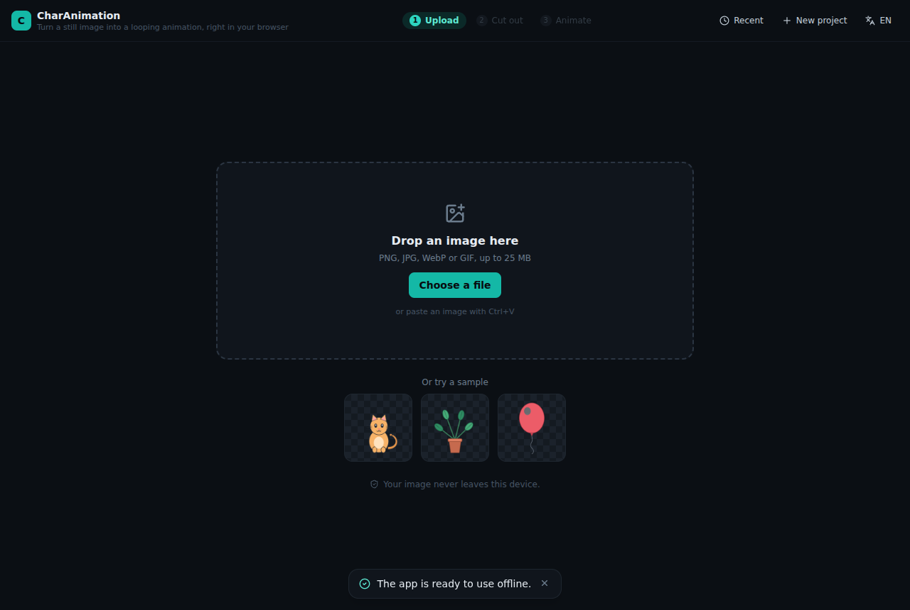
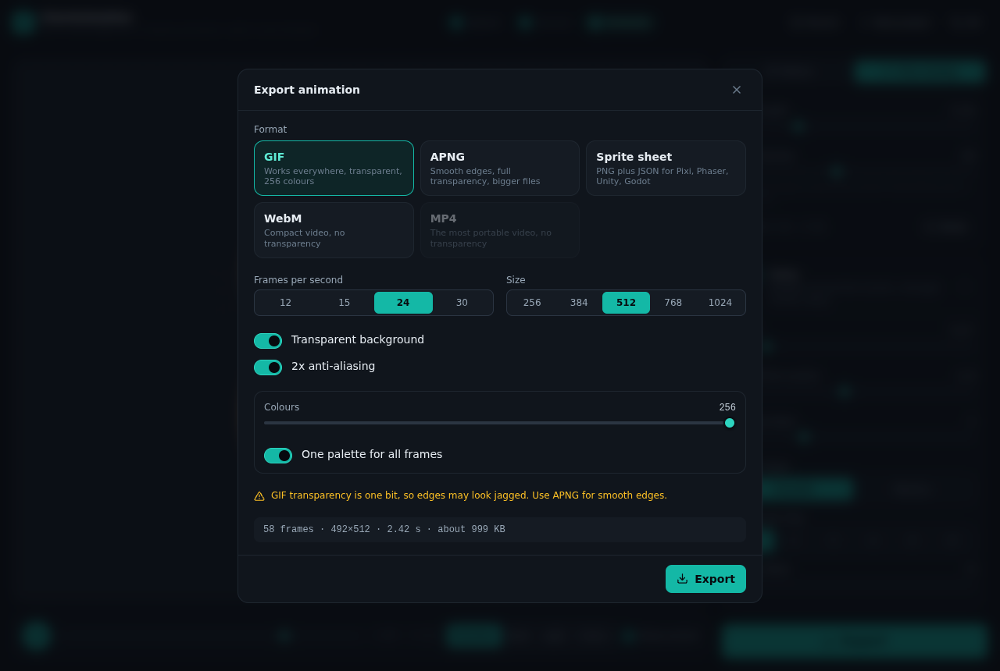
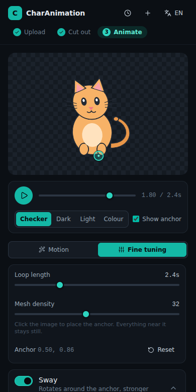

# CharAnimation

Biến một ảnh tĩnh thành animation loop mượt mà — tách nền và dựng chuyển động
**hoàn toàn trong trình duyệt**. Không máy chủ, không tài khoản, ảnh không rời
khỏi máy người dùng.

> Turn a still image into a seamless looping animation, entirely client-side.
> No backend, no account, the image never leaves the device.



| Dựng chuyển động | Xuất tệp |
|---|---|
|  |  |

## Ba bước

1. **Tải ảnh** — kéo thả, chọn tệp, dán bằng `Ctrl+V`, hoặc chọn một ảnh mẫu.
2. **Tách nền** — mô hình AI chạy ngay trong trình duyệt. Ảnh đã có nền trong
   suốt thì bước này tự động bỏ qua.
3. **Chuyển động** — chọn một trong tám kiểu, tinh chỉnh, rồi xuất GIF, APNG,
   sprite sheet, MP4 hoặc WebM.

## Vì sao loop luôn khớp

Mọi chuyển động được ghép từ các sóng có **số nhịp nguyên trên một vòng lặp**.
Nhờ đó `f(0)` bằng đúng `f(T)` về mặt toán học, không cần xử lý hậu kỳ, không có
cú giật ở điểm nối. Bộ xuất cũng cố tình bỏ khung hình cuối vì nó trùng khung
đầu. Điều này được kiểm chứng bằng unit test cho cả tám preset.

## Chạy thử

```bash
npm install
npm run dev          # http://localhost:5173
```

## Lệnh

| Lệnh | Việc |
|---|---|
| `npm run dev` | Máy chủ phát triển |
| `npm run build` | Build tĩnh vào `dist/` |
| `npm run preview` | Xem thử bản build |
| `npm test` | Unit test (Vitest) |
| `npm run test:e2e` | Test end-to-end (Playwright) |
| `npm run lint` | ESLint |
| `npm run typecheck` | TypeScript |

Bộ e2e tự khởi động máy chủ preview. Nếu môi trường đã có sẵn Chromium, trỏ vào
nó bằng `CHROMIUM_PATH=/đường/dẫn/chromium npm run test:e2e`.

Hai bộ test phụ, tắt theo mặc định:

```bash
VISUAL=1 npx playwright test visual        # chụp màn hình toàn luồng
BENCH=1 npx playwright test benchmark      # đo fps và thời gian xuất
```

## Triển khai

Đây là site tĩnh thuần. `npm run build` tạo `dist/`, đưa lên bất kỳ host tĩnh nào.

- **GitHub Pages** — workflow `.github/workflows/deploy.yml` tự chạy khi push vào
  `main`. Bật Pages với nguồn "GitHub Actions" trong Settings.
- **Cloudflare Pages, Netlify, Vercel** — build `npm run build`, thư mục `dist`.

Khi deploy vào thư mục con, đặt `PUBLIC_BASE_PATH=/tên-repo/` lúc build.

## Định dạng xuất

| Định dạng | Nền trong suốt | Dùng khi |
|---|---|---|
| GIF | Có, một mức | Dán vào chat, mạng xã hội, tài liệu |
| APNG | Có, đầy đủ 8 bit | Cần viền mượt trên nền bất kỳ |
| Sprite sheet | Có | Đưa vào game engine (Pixi, Phaser, Unity, Godot) |
| WebM | Không | Video nhẹ cho web |
| MP4 | Không | Video phổ thông nhất |

Sprite sheet xuất kèm JSON theo chuẩn TexturePacker "JSON Hash", nạp thẳng được
vào Pixi và Phaser.

## Mức độ đã kiểm chứng

82 unit test phủ phần toán của engine, phép tính alpha và cách xếp sprite sheet.
10 test end-to-end chạy trên bản build thật và **mở tệp xuất ra để kiểm tra**:
chữ ký GIF89a, khối lặp `NETSCAPE2.0`, khối `acTL`/`fcTL` của APNG, và JSON của
sprite sheet đối chiếu với số khung hình.

Riêng khâu suy luận của mô hình tách nền chưa chạy được trong môi trường dựng
bản vì CDN chứa trọng số bị chặn. Đường xử lý lỗi cho tình huống đó thì đã có
test. Xem [`docs/BENCHMARK.md`](docs/BENCHMARK.md).

## Riêng tư

Không có API nào nhận ảnh. Trình duyệt chỉ tải mã của ứng dụng và trọng số mô
hình tách nền. Dự án được lưu trong IndexedDB trên chính máy người dùng. Bạn có
thể tự kiểm chứng bằng tab Network.

## Ngoại tuyến

Sau lần truy cập đầu, service worker giữ lại mã ứng dụng và trọng số mô hình.
Từ đó ứng dụng chạy được khi không có mạng và cài được như một ứng dụng.

## Trên màn hình nhỏ

Bố cục chuyển thành một cột, bảng điều khiển nằm dưới khung xem thử.



## Tài liệu

- [`docs/PLAN.md`](docs/PLAN.md) — kế hoạch xây dựng ban đầu
- [`docs/ARCHITECTURE.md`](docs/ARCHITECTURE.md) — kiến trúc thực tế và các quyết định kỹ thuật
- [`docs/PRESETS.md`](docs/PRESETS.md) — tham số của từng kiểu chuyển động
- [`docs/BENCHMARK.md`](docs/BENCHMARK.md) — số đo hiệu năng

## Giấy phép

Mã nguồn: MIT.

Phụ thuộc cần lưu ý: `@imgly/background-removal` dùng giấy phép **AGPL-3.0**.
Nếu bạn cần phát hành sản phẩm đóng mã, hãy đổi sang bộ điều hợp
Transformers.js (Apache-2.0) đã có sẵn:

```bash
npm install @huggingface/transformers
VITE_BG_ADAPTER=transformers npm run build
```

Ảnh mẫu trong `public/samples/` được sinh bằng `scripts/make-samples.py` và
thuộc cùng giấy phép với mã nguồn.
