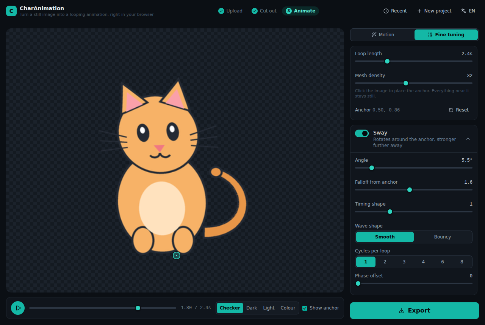

# Kiểu chuyển động

Mỗi kiểu là một tập tham số cho engine trong `src/engine/presets.ts`. Bảng dưới
là giá trị thực tế đang chạy, dùng để tra cứu hoặc dựng lại bằng tay.

Điểm neo ghi dạng `pu/pv`, chuẩn hoá theo chiều rộng và chiều cao ảnh. `0.5/1`
là giữa cạnh dưới, tức phần chân nhân vật đứng yên. Khi tải ảnh, ứng dụng tự
dời điểm neo tới đáy vùng có pixel thay vì đáy khung ảnh.

## Sáu bộ điều biến

| Tên | Làm gì | Tham số riêng |
|---|---|---|
| `sway` | Xoay quanh điểm neo, biên độ tăng dần theo khoảng cách tới neo | `amountDeg`, `falloff`, `ease`, `shape` |
| `wind` | Sóng chạy dọc trục dọc, kiểu cỏ hoặc vải bị gió tạt | `amount`, `wavelength`, `falloff` |
| `wiggle` | Hai sóng lệch pha theo `u` và `v`, cho cảm giác mềm oặt | `amount`, `scaleU`, `scaleV`, `falloff` |
| `breathe` | Co giãn không đều quanh điểm neo | `amountX`, `amountY`, `preserveVolume`, `ease`, `shape` |
| `bob` | Tịnh tiến cả khối | `amountX`, `amountY`, `shape`, `ease` |
| `jitter` | Rung nhẹ tần số cao, không tương quan giữa hai trục | `amount` |

Mọi bộ điều biến đều có `freq` (số nhịp trên một vòng lặp, **bắt buộc nguyên**)
và `phase` (lệch pha tính theo vòng, 0 đến 1).

### Các tham số dùng chung

- **`falloff`** định hình cách biên độ tăng theo khoảng cách tới điểm neo. Giá
  trị 1 là tuyến tính, lớn hơn 1 giữ phần gần neo đứng yên lâu hơn, nhỏ hơn 1
  làm cả khối chuyển động gần như đồng đều.
- **`ease`** bẻ cong nhịp mà không phá chu kỳ. Lớn hơn 1 khiến chuyển động nán
  lại ở hai biên, nhỏ hơn 1 khiến nó nán ở giữa.
- **`shape`** chọn `sine` (mượt) hoặc `bounce` (chỉnh lưu, tạo cảm giác va đập).
- **`preserveVolume`** ràng buộc co ngang bằng nghịch đảo giãn dọc, nên nhân vật
  bẹt ra khi lùn xuống — đúng quy tắc squash and stretch của hoạt hình.

Các giá trị `amount*` là tỉ lệ so với chiều rộng hoặc chiều cao ảnh, nên một
preset hoạt động giống nhau với mọi kích thước ảnh.

## Tám preset

### Đung đưa (`sway`) — vòng lặp 2,4 s, neo 0.5/1
Mặc định, hợp với hầu hết nhân vật đứng.
- `sway`: freq 1, amountDeg 5.5, falloff 1.6, ease 1, shape sine
- `breathe`: freq 1, amountY 0.012, amountX 0.01, preserveVolume

### Nhấp nhô (`bob`) — vòng lặp 1,8 s, neo 0.5/1
Nhún tại chỗ. Nhịp thở lệch nửa vòng so với nhịp nhún nên hai chuyển động không
cộng dồn thành một cú giật.
- `bob`: freq 1, amountY −0.03
- `breathe`: freq 1, phase 0.5, amountY 0.018

### Thở (`breathe`) — vòng lặp 3,2 s, neo 0.5/1
Gần như đứng yên, chỉ phồng xẹp rất nhẹ. Dùng khi muốn ảnh "sống" mà không phân
tán sự chú ý.
- `breathe`: freq 1, amountY 0.03, amountX 0.014, ease 1.2, preserveVolume
- `bob`: freq 1, amountY −0.008

### Lơ lửng (`float`) — vòng lặp 3,6 s, neo 0.5/0.5
Neo đặt ở giữa ảnh vì vật thể bay không có điểm tựa dưới đất.
- `bob`: freq 1, amountY −0.035, amountX 0.012
- `sway`: freq 1, phase 0.25, amountDeg 2.5, falloff 1

### Gió thổi (`wind`) — vòng lặp 2,2 s, neo 0.5/1
Sóng chạy hai nhịp mỗi vòng, chồng lên một nhịp nghiêng chậm hơn. Hai tần số
khác nhau khiến chuyển động trông ngẫu nhiên dù vẫn lặp chính xác.
- `wind`: freq 2, amount 0.035, wavelength 1.1, falloff 1.5
- `sway`: freq 1, amountDeg 3.5, falloff 1.7

### Uốn éo (`wiggle`) — vòng lặp 1,6 s, neo 0.5/1
- `wiggle`: freq 2, amount 0.024, scaleU 5, scaleV 9, falloff 1.1

### Nảy (`bounce`) — vòng lặp 1,2 s, neo 0.5/1
Dạng sóng `bounce` ở cả hai bộ điều biến tạo điểm chạm đất rõ ràng. Nhịp nhún
lệch nửa vòng so với nhịp bẹt, nên nhân vật bẹt ra đúng lúc chạm đáy.
- `breathe`: shape bounce, freq 1, amountY −0.09, ease 1.4, preserveVolume
- `bob`: shape bounce, freq 1, phase 0.5, amountY −0.07, ease 1.6

### Treo lắc (`pendulum`) — vòng lặp 2,6 s, neo 0.5/0
Neo đặt ở cạnh trên nên phần dưới lắc mạnh nhất. `falloff` gần 1 để toàn thân
xoay như một vật cứng, `ease` 1.25 giữ lại lâu hơn ở hai biên, đúng cảm giác
quả lắc chậm dần rồi đổi chiều.
- `sway`: freq 1, amountDeg 11, falloff 1.05, ease 1.25

## Bảng tinh chỉnh

## Tự tạo kiểu riêng

Chỉnh bất kỳ thanh trượt nào sẽ chuyển sang chế độ `custom`. Bạn bật tắt và
phối hợp sáu bộ điều biến tuỳ ý — loop vẫn luôn khớp, vì mọi tần số đều bị giới
hạn trong tập số nguyên `{1, 2, 3, 4, 6, 8}`.

Thiết lập riêng có thể lưu ra tệp `.charanim.json` qua hộp thoại "Gần đây" và
nạp lại cho ảnh khác.
